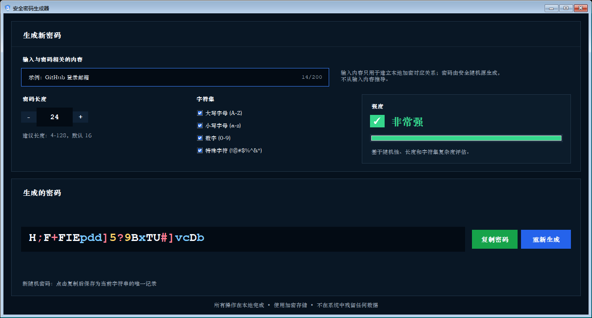

# 安全密码生成器

本项目是一个本地运行的跨平台图形密码生成器，用于根据用户输入的关联字符串生成安全、随机、不可预测的密码。密码不是从输入内容推导出来的；输入内容只用于在本机加密存储中查找或保存唯一对应关系。



## 功能特点

- 使用 Python `secrets` 和系统 CSPRNG 生成随机密码。
- 默认生成 16 位高强度密码，包含大写字母、小写字母、数字和特殊字符。
- 支持手动输入或按钮调整密码长度，范围为 `4-128`。
- 支持选择内置字符集：大写字母、小写字母、数字、特殊字符。
- 无输入字符串时不显示密码。
- 输入字符串变化时生成新的随机候选密码；如果已有本地加密记录，则直接显示该字符串唯一对应的历史密码。
- 密码框支持彩色字符显示，并允许鼠标选中、拖动查看长密码。
- 禁止直接从密码框复制或编辑；只能通过“复制密码”按钮复制。
- 点击“复制密码”后，会保存或更新当前输入字符串与密码的唯一加密映射。
- 历史记录不以列表形式展示，只在输入对应字符串后显示唯一密码。
- 加密数据仅保存在软件目录下的 `storage/`，不会写入系统用户配置目录。

## 项目结构

```text
.
├── assets/                         # 应用图标资源
├── docs/
│   └── screenshots/                # README 截图
├── scripts/
│   ├── build_deb.py                # Debian 包构建脚本
│   └── build_windows.ps1           # Windows 单文件 exe 构建脚本
├── src/
│   └── secure_random_password_generator/
│       ├── cli.py                  # CLI 入口逻辑
│       ├── gui.py                  # Tkinter 图形界面
│       ├── password_core.py        # 密码生成与强度策略
│       └── secure_store.py         # 本地 AES-GCM 加密存储
├── tests/
│   └── run_tests.py                # 单元测试与 GUI 冒烟测试
├── main.py                         # 图形应用启动入口
├── pyproject.toml                  # Python 项目元数据
└── README.md
```

## 环境要求

- Python `3.9+`
- Tkinter
- `cryptography`
- Windows 构建 exe 时需要 `pyinstaller`

Linux Debian/Ubuntu 可安装运行依赖：

```bash
sudo apt update
sudo apt install python3 python3-tk python3-cryptography
```

## 从源码运行

Windows PowerShell：

```powershell
$env:PYTHONPATH = "$PWD\src"
python -m secure_random_password_generator
```

Linux/macOS shell：

```bash
PYTHONPATH="$PWD/src" python -m secure_random_password_generator
```

也可以直接运行 GUI 启动文件：

```powershell
$env:PYTHONPATH = "$PWD\src"
python .\main.py
```

## 命令行使用

CLI 模式只输出密码本身，适合脚本调用：

```powershell
$env:PYTHONPATH = "$PWD\src"
python -m secure_random_password_generator --length 20 --text "github-login"
```

常用参数：

```text
--length, -l       密码长度
--text, -t         关联字符串，不用于推导密码
--charset          使用指定字符集
--extra-chars      在内置字符集外追加字符
--no-uppercase     不使用大写字母
--no-lowercase     不使用小写字母
--no-digits        不使用数字
--no-symbols       不使用特殊字符
--min-entropy      最低熵要求，默认 60 bit
--no-history       不保存本次命令行生成记录
```

示例：

```powershell
python -m secure_random_password_generator --length 24 --text "office-wifi" --no-history
```

## 构建 Windows exe

先把构建依赖安装到项目目录下，避免污染系统 Python：

```powershell
python -m pip install --target .build_deps pyinstaller cryptography
```

构建单文件 Windows 应用：

```powershell
.\scripts\build_windows.ps1
```

输出文件：

```text
dist\SecureRandomPasswordGenerator-independent.exe
```

脚本只生成独立单文件 exe，不生成文件夹版应用。

## 构建 Debian 包

```powershell
python .\scripts\build_deb.py
```

输出文件：

```text
dist\secure-random-password-generator_1.0.0_all.deb
```

安装：

```bash
sudo dpkg -i dist/secure-random-password-generator_1.0.0_all.deb
```

卸载：

```bash
sudo apt remove secure-random-password-generator
```

完全清理本地加密存储：

```bash
sudo apt purge secure-random-password-generator
```

## 测试

```powershell
python .\tests\run_tests.py
```

测试覆盖：

- 密码生成策略
- 输入字符串不参与密码推导
- 本地加密存储读写
- 字符串与密码唯一映射
- GUI 初始化、长度输入、密码框只读与复制限制

## 本地数据存储

应用只在软件目录内保存加密数据：

```text
<software-directory>/storage/<user-namespace>/history.enc
<software-directory>/storage/<user-namespace>/app.key
```

说明：

- `history.enc` 保存 AES-GCM 加密后的字符串与密码映射。
- `app.key` 是本地加密密钥。
- 如果软件目录不可写，应用会报错，不会静默回退到系统用户配置目录。
- `storage/` 已加入 `.gitignore`，不会进入 Git 提交。

## Git 提交建议

仓库只提交源码、测试、脚本、文档和截图。以下内容不会提交：

- `.build_deps/`
- `build/`
- `dist/`
- `storage/`
- `_MEI*/`
- `__pycache__/`
- `*.spec`
